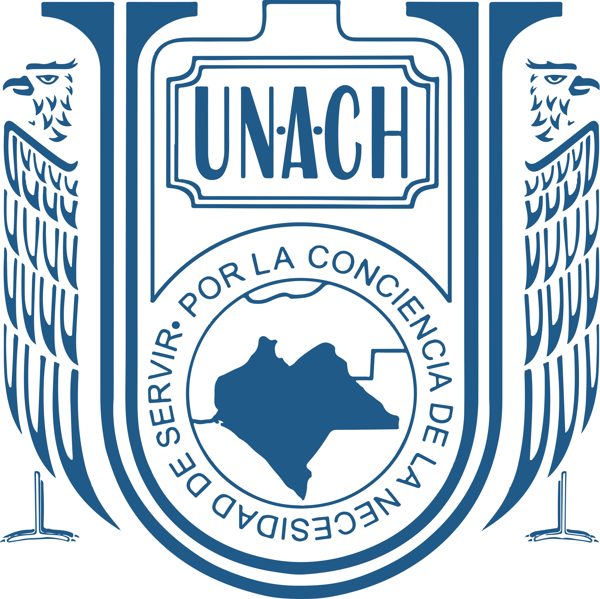
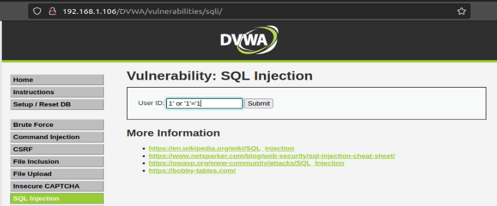

<center>

# Universidad Autónoma De Chiapas

## Projecto Final: Desarrollo De Aplicaciones Web Y Moviles.

### **Catedrático:** DR. Luis Gutíerrez Alfaro

### **Integrantes del equipo**

#### - José Gilberto Guzmán Gutiérrez.


#### - Julio Manuel Gómez Hernández.

#### Tuxtla Gutiérrez Chiapas. 30 de octubre del 2023.

</center>




# Pruebas.

### IP.

Gilberto: 10.33.26.157
Julio: 192.168.1.106

#### Prueba inyeccion Sql

1' or '1'='1



Acceso denegado


#### Prueba XSS Reflected
``` js
<script>alert(document.cookie)</script>
```


Acceso denegado


#### Ataque SQLMap

``` bash
    sqlmap -u "https://192.168.1.106/DVWA/vulnerabilities/sqli/?id=1&Submit=Submit#"--cookie="PHPSESSID=4sdrjdtrr1n3l1j8k539fbf3qr;security=low"
```

**Resultado:** No puede ser Inyectable


#### Proteccion de rutas
ingresando a las siguiente URL (Rutas) no nos debe dar acceso.
 https://192.168.1.106/DVWA/docs/

 

 https://192.168.1.106/dvwa/images/
  

  #### Ataque Hydra 

  ``` bash
    hydra 192.168.1.106 http-form-post "/DVWA/login.php:username=^USER^&password=^PASS^&Login=submit:Login failed" -L usernames.txt -P passwords.txt
```
 


   ``` bash
    hydra -l admin -p password 192.168.1.106 http-get-form "/dvwa/login.php:username=^USER^&password=^PASS^&Login=Login:H=Cookie: PHPSESSID=4sdrjdtrr1n3l1j8k539fbf3qr; security=low:F=Username and/or password incorrect" -V
```

 

 